# 宝宝特效 AiyaEffecSDK iOS 快速集成

## Step1 Tích hợp framework
 1. Tải về dự án AiyaEffectsIOS ， giải nén AiyaEffectsIOS/AiyaEffectSDK  sao chép vào thư mục dự án mục tiêu để quản lý, nếu bạn không muốn sao chép

 2. Kéo AiyaEffectsIOS / AiyaEffectSDK / AiyaEffectSDK.xcodeproj tới dự án xcode

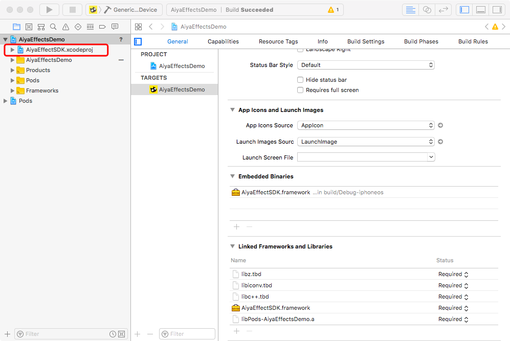

 3. Thêm các dự án bên ngoài phụ thuộc

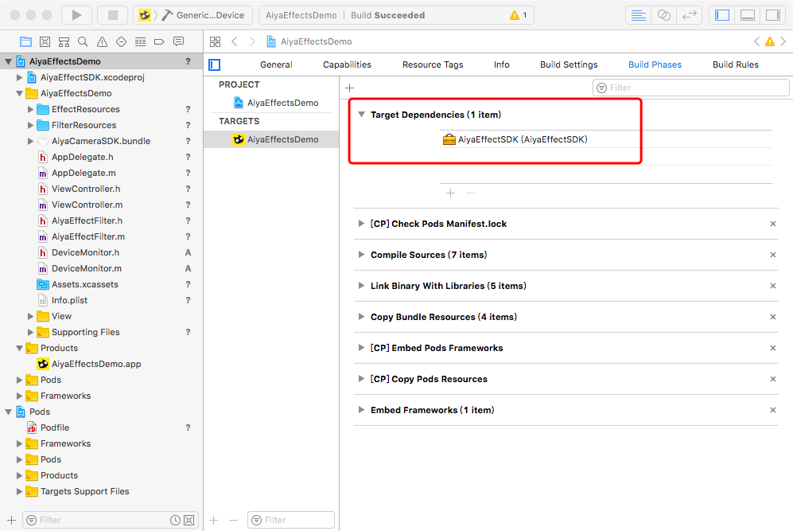

 4. Liên kết SDK

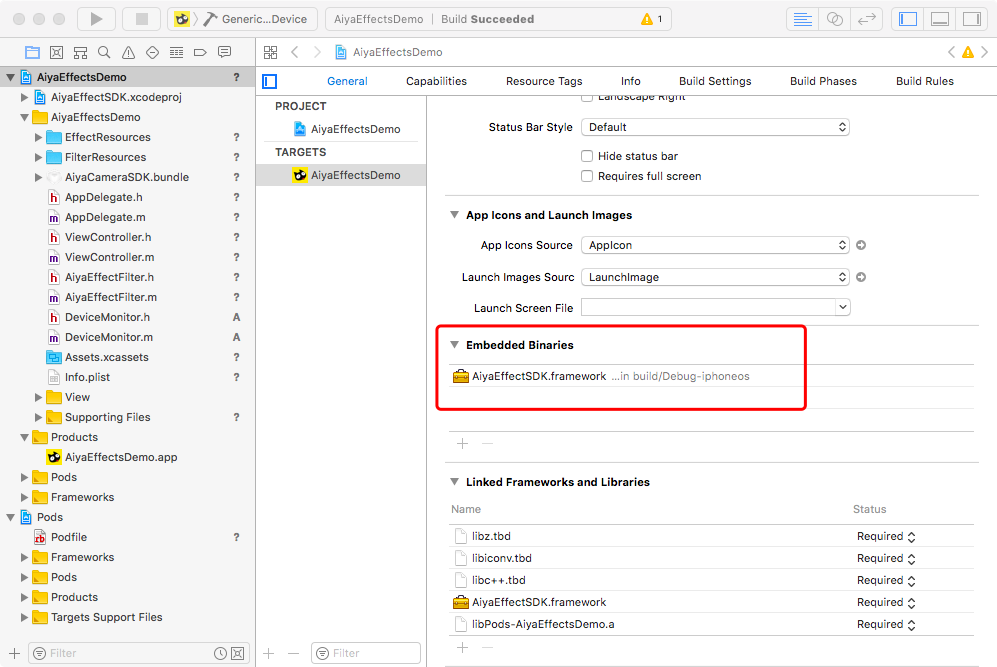

 5. Liên kết thư viện hệ thống

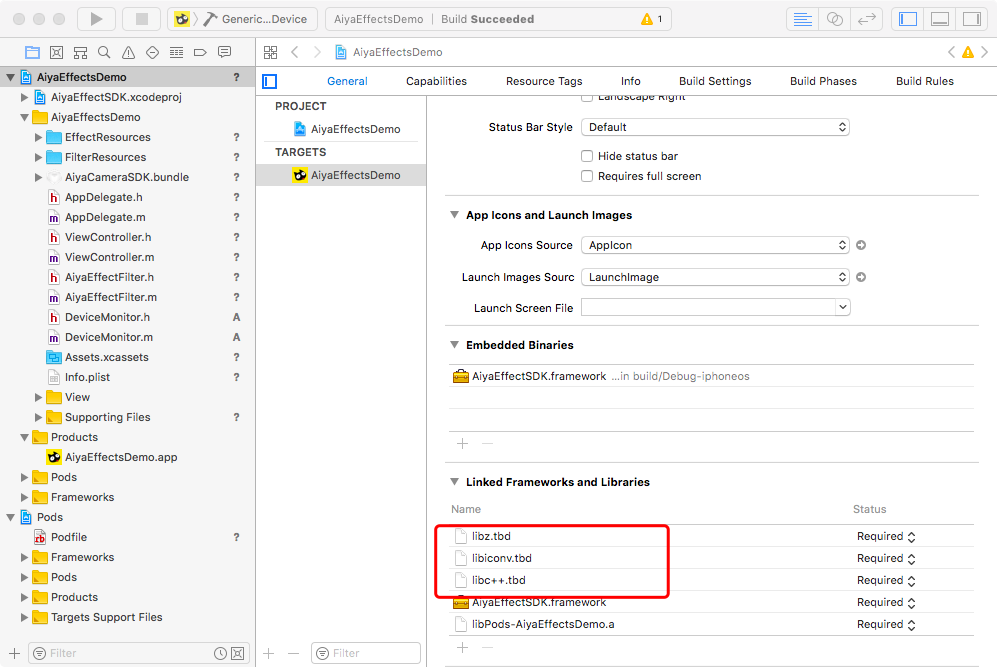

 6. Theo nhu cầu của sự lựa chọn tương ứng của mô-đun, mô-đun nhỏ hơn, sự gia tăng nhỏ hơn Kích cỡ ứng dụng

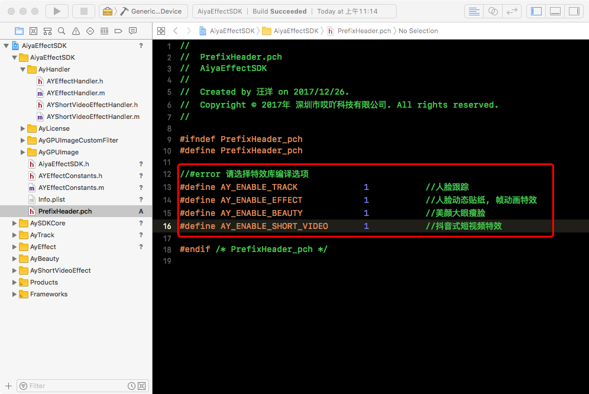

 7. Nhập các nguồn tài nguyên, kéo AiyaEffectsIOS / AiyaEffectSDK / AiyaEffectSDK.bundle tới dự án xcode

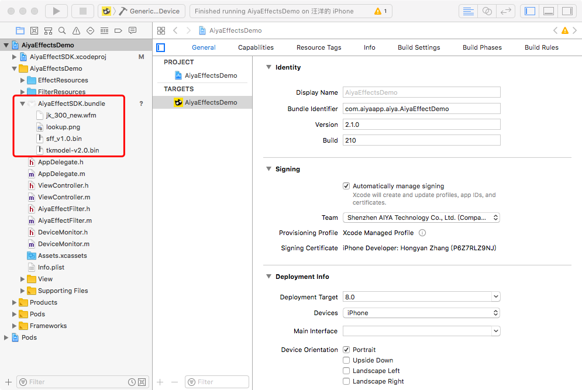

Lưu ý: Nếu bạn không sử dụng mô-đun nhận dạng khuôn mặt có thể được gỡ bỏAiyaEffectSDK.bundle trong jk_300.new.wfm， sff_v1.0.bin， tkmodel_v2.0.bin

Lưu ý: Nếu bạn không sử dụng bộ lọc có thể bị xóa AiyaEffectSDK.bundle trong lookup.png

## Step2 初始化License
Khi sử dụng AiyaEffecSDK 之前，必须先初始化 license，否则会出现无法使用的情况，申请 appKey 请访问[宝宝特效](http://www.lansear.cn/product/bbtx)

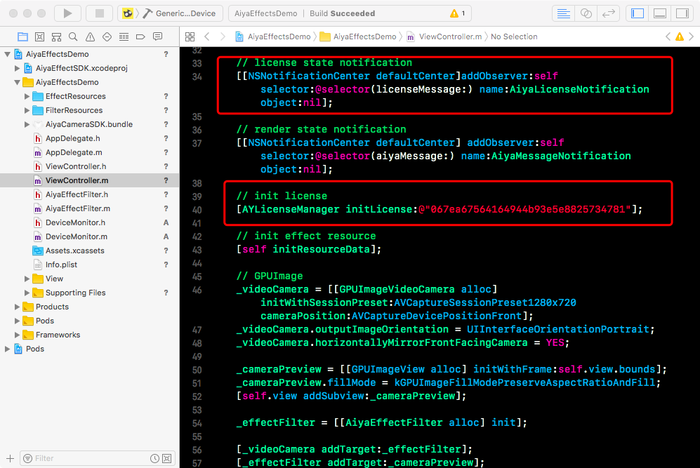

## Step3 Sử dụng nhãn hiệu động

### Gọi một cách:
Tạo một máy ảnh tùy chỉnh, máy ảnh và ghi lại và thêm nhãn dán chức năng, cách tiếp cận này có thể tham khảo AiyaEffectsIOS / demo / AiyaVideoRecord

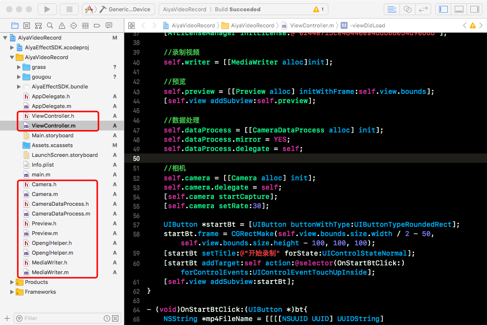

### Cách 2:
Gói AYEffectHandler GPUImageFilter sử dụng, cách tiếp cận này có thể tham khảo AiyaEffectsIOS / demo / AiyaEffectSDKDemo

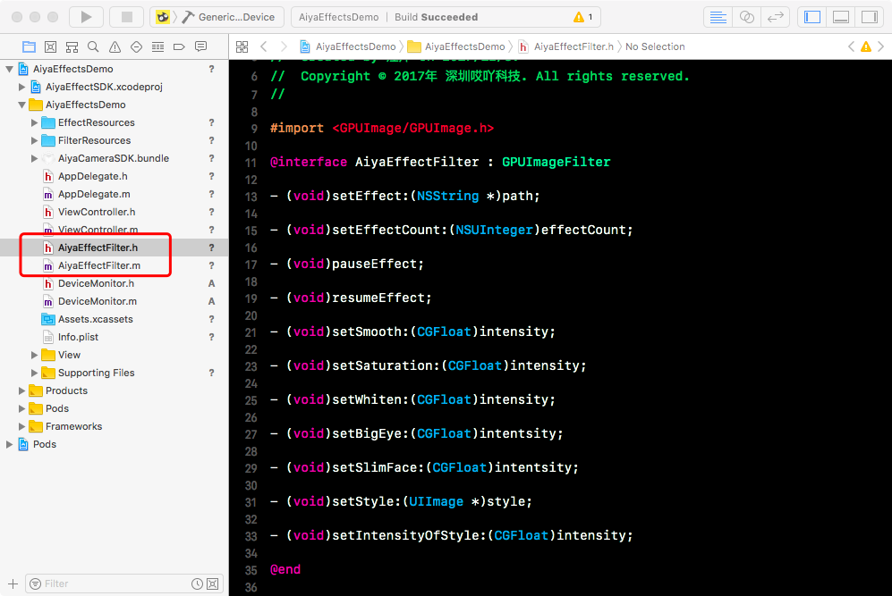

### Cách ba: :
使用 AYEffectHandler 处理 CVPixelBufferRef (BGRA格式)， 这种方式可参考[集成到Zego示例](https://github.com/aiyaapp/AiyaEffectsWithZegoIOS)

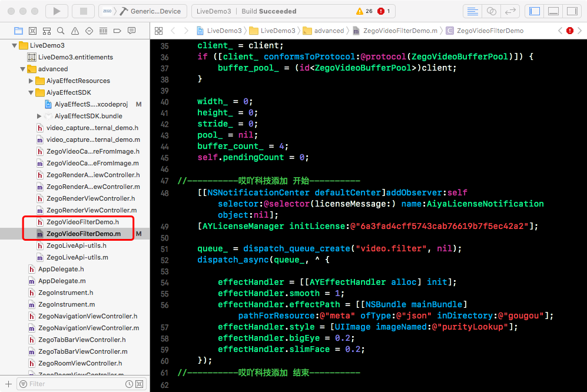

### 调用方式四:
使用 AYEffectHandler 处理 Texture (BGRA格式)， 这种方式可参考[集成到腾讯云示例](https://github.com/aiyaapp/AiyaEffectsWithTXIOS)

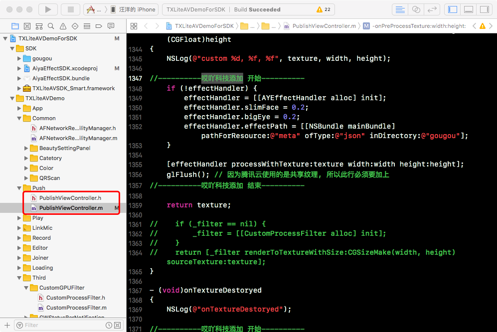

## Step4 使用帧动画特效

### 调用方式:
使用 AYAnimHandler 进行帧动画绘制，这种方式可参考 AiyaEffectsIOS/demo/AiyaAnimEffectDemo

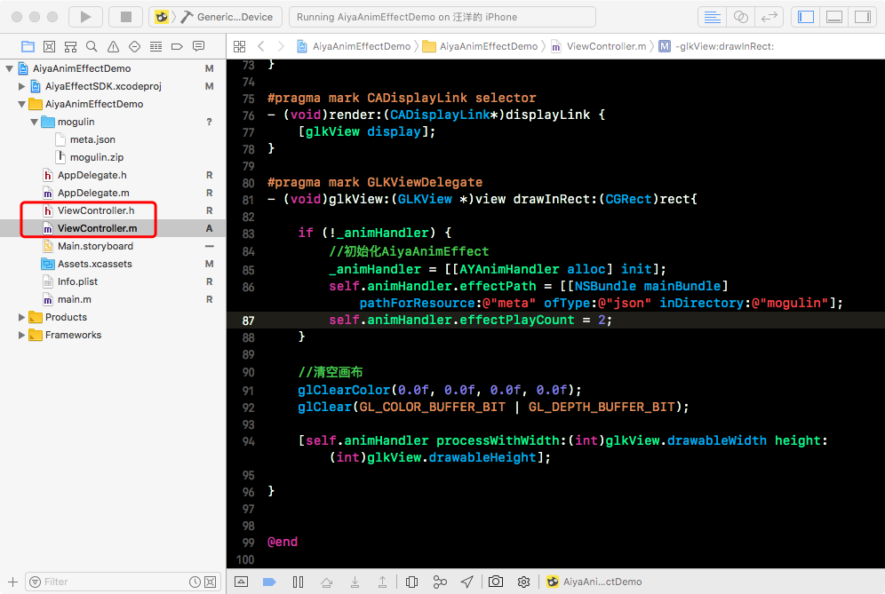

## Step5 使用短视频特效

### 调用方式:
使用 AYShortVideoEffectHandler 处理 Texture (BGRA格式)， 这种方式可参考 AiyaEffectsIOS/demo/AiyaShortVideoEffectDemo

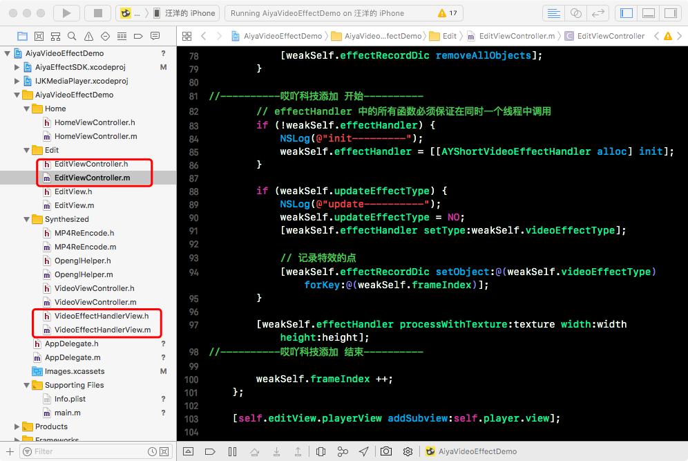
