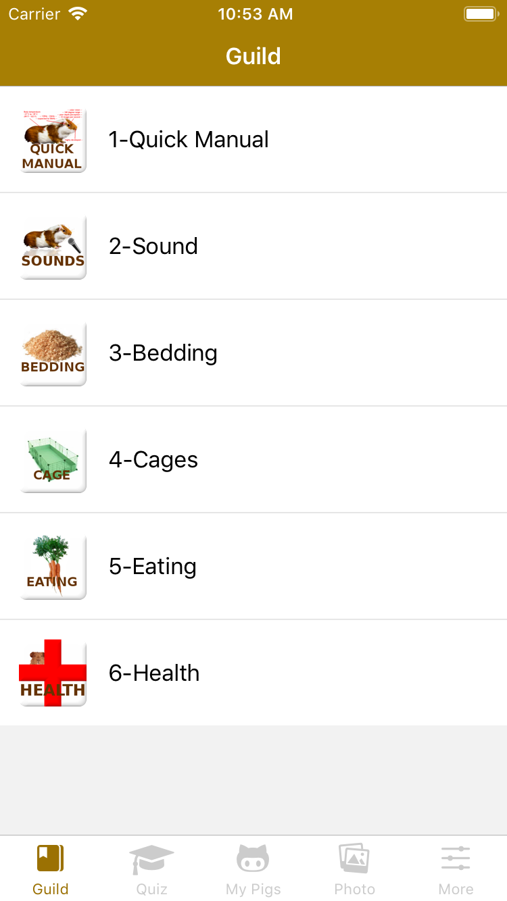

<h3 align="center">Guinea Pig Ultimate Guild</h3>

---

This is friendly and concise (and fun) Guinea Pig Instructions Manual, 

### User of this manual will become expert in:
- Feeding the cavy the right food, and avoiding the potentially harmful food
- Guinea pig sounds and noises - what your pet is trying to tell you
- Choosing and arranging guinea pig cage - sizes, types, cleaning instructions
- Choosing and combining comfortable bedding materials
- Signs and symptoms of health and illnesses

### App Features:
- essential facts and precise instructions for guinea pig care
- quick instructions for those who need the basics fast
- intuitive navigation and content structure
- lots of nice descriptive graphics
- guinea pig care test with random questions for the evaluation of your knowledge
- guinea pig wallpapers

### Quick Guild:

* [Quick](https://iop883684.github.io/guinepig/images/quick.html)
* [Sound](https://iop883684.github.io/guinepig/images/sound.html)
* [Bedding](https://iop883684.github.io/guinepig/images/beding.html)
* [Cage](https://iop883684.github.io/guinepig/images/cages.html)
* [Eating](https://iop883684.github.io/guinepig/images/eating.html)
* [Healh](https://iop883684.github.io/guinepig/images/health.html)

### Download

### Contact us:

Get in touch with me for support via: iop883684@gmail.com

